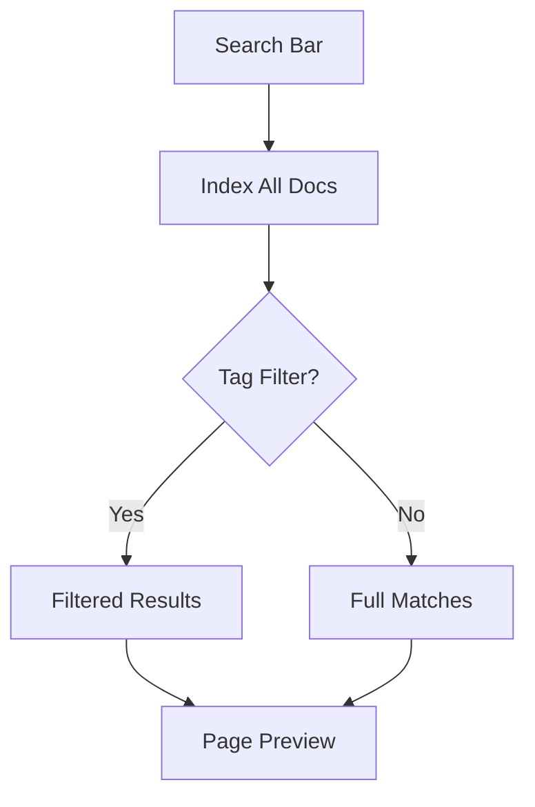

## Overview

Oleg Dudaev provides powerful tools to streamline your documentation workflow. You organize documents into structured spaces, track changes with version control, collaborate seamlessly with teams, and navigate content efficiently. These core features help you maintain high-quality, up-to-date project docs.

<Columns cols={2}>
  <Card title="Document Organization" icon="folder" href="#document-organization">
    Structure your docs with folders, tags, and hierarchies.
  </Card>
  <Card title="Version Control" icon="git-branch" href="#version-control">
    Track changes like code with Git integration.
  </Card>
  <Card title="Collaboration" icon="users" href="#collaboration">
    Share, review, and merge docs effortlessly.
  </Card>
  <Card title="Search & Navigation" icon="search" href="#search-navigation">
    Find and explore content quickly.
  </Card>
</Columns>

## Document Organization Tools

Create intuitive folder structures and tag systems to keep your docs accessible. You nest pages hierarchically and apply tags for cross-referencing.

<Steps>
  <Step title="Create Folders" icon="folder-plus">
    In the sidebar, click `New Folder` and name it `api-reference`.

    ```
    docs/
    ├── introduction.mdx
    └── api-reference/
        └── endpoints.mdx
    ```
  </Step>
  <Step title="Add Tags" icon="tag">
    Edit page frontmatter:

````mdx
````
---
title: Endpoints
tags: ["api", "reference"]
---
````
````
  </Step>
  <Step title="Reorder Pages" icon="move">
    Drag pages in the sidebar to match your navigation flow.
  </Step>
</Steps>

<Callout kind="tip">
  Use tags like `["feature", "guide"]` for dynamic filtering in search.
</Callout>

## Version Control Basics

Integrate Git to version your docs like source code. You commit changes, create branches, and merge updates safely.

<CodeGroup tabs="Bash,CLI">
````bash
git add docs/*.mdx
git commit -m "Update API endpoints docs"
git push origin main
````

````bash
# Branch for new feature
git checkout -b feature/new-section
git add .
git commit -m "Add collaboration guide"
git push origin feature/new-section
````
</CodeGroup>

Connect your repo in settings to enable automatic previews on pull requests.

## Collaboration Workflows

Invite team members and manage reviews with comments and approvals.

<Tabs>
  <Tab title="Review & Comment" icon="message-circle">
    Share a page link. Collaborators add inline comments:

    ```
    <!-- Comment: Clarify this API response format -->
    ```

    Resolve comments before merging.
  </Tab>
  <Tab title="Real-time Editing" icon="edit-3">
    Enable live sessions for simultaneous edits. Changes sync instantly.
  </Tab>
  <Tab title="Merge Conflicts" icon="git-merge">
    Git handles conflicts; resolve in the visual diff editor.
  </Tab>
</Tabs>

## Search and Navigation Features

Find content with full-text search across all docs. Use advanced filters for tags and dates.

```
Search: "authentication" → Filters: api, guide
```

<Expandable title="Advanced Search Syntax" default-open="false">

- Quotes: `"exact phrase"`
- Exclude: `-deprecated`
- Tags: `tag:api`

</Expandable>



<Columns cols={3}>
  <Card title="Quickstart" icon="zap" href="/quickstart">
    Get started in minutes.
  </Card>
  <Card title="Authentication" icon="lock" href="/authentication">
    Secure your docs.
  </Card>
  <Card title="Changelog" icon="git-commit" href="/changelog">
    Track updates.
  </Card>
</Columns>